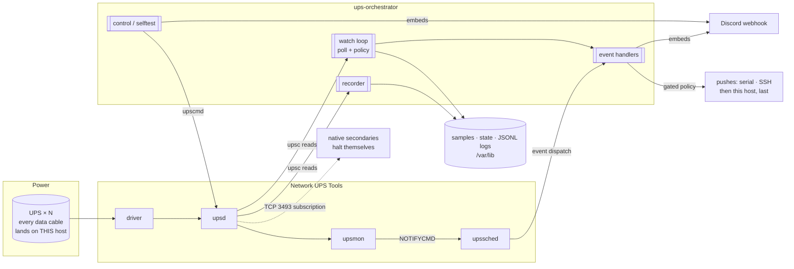
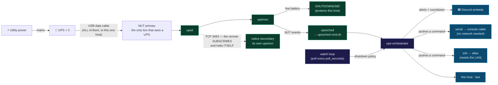
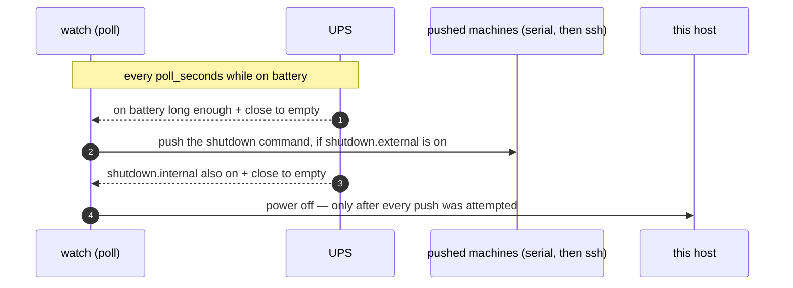

# ups-orchestrator ⚡

**NUT-driven UPS power-event monitor with per-UPS Discord embeds**

<p align="center">
  <em>Multi-UPS · NUT-event alerts · opt-in gated shutdowns · audit reports · zero runtime deps</em>
</p>

<p align="center">
  <a href="https://github.com/kleinpanic/ups-orchestrator/actions/workflows/ci.yml"></a>
  
  
  
  
  
  
  
</p>

It turns [Network UPS Tools](https://networkupstools.org/) power events into
**per-UPS Discord embeds** for on-battery alerts, a runtime-remaining countdown,
power-restored summaries, and low-battery warnings — and, if you turn it on, it
makes sure every machine on a dying UPS gets shut down cleanly.

Works with any NUT-supported UPS and monitors **any number** of them. Nothing is
hard-coded to a model.

📖 **Full docs: the [project wiki](https://github.com/kleinpanic/ups-orchestrator/wiki) · [GitHub Pages site](https://kleinpanic.github.io/ups-orchestrator/).**

## How this actually works — read this first

**Every UPS data cable plugs into one machine.** All three UPS USB cables land
on a single host — the **NUT primary** (a Raspberry Pi 5 in this deployment).
That machine is the only one on the network that can read a battery percentage
or a runtime estimate, because it is the only one physically wired to a UPS.

**So every other machine has to be *told* to shut down.** It cannot work out on
its own that the power is failing; nothing it can see has changed. That single
fact is what the whole shutdown side of this project is about, and
`shutdown_method` is nothing more than the choice of **how a machine is told**:

| `shutdown_method` | Who issues the poweroff | How the machine learns | What the far end needs | Survives a dead LAN |
|---|---|---|---|---|
| **`native`** | the machine itself | its own `upsmon` reads the primary's `upsd` over the LAN | `nut-client` and a working network | ❌ |
| **`ssh`** | the primary | it doesn't — it just receives a command | `sshd`, an authorised key, passwordless `sudo shutdown` | ❌ |
| **`serial`** | the primary | it doesn't — it just receives a command | a console cable and an auto-login getty | ✅ |
| **`none`** | nobody | — | — | — |

A machine holds **exactly one** of these. They are alternatives, not layers.

### `native` does *not* need a USB cable on the remote machine

This is the single most misunderstood point in the whole design. A `native`
machine runs its own `upsmon`, and that `upsmon` opens a **TCP connection over
the LAN** to the primary's `upsd` on **port 3493**. It reads the UPS status from
the primary and, when that status goes critical, powers **itself** off. The
primary pushes nothing at it and does not run any command on it.

It is a *network subscription* to the primary's view of a UPS — not a local
reading of one. That is why `monitor add --method native` sets up a `LISTEN`
line, an `upsd.users` account and an nftables rule: **all of that machinery
exists for one purpose, opening TCP 3493 to that one host safely.** None of it
has anything to do with cabling.

`ssh` and `serial` are the opposite shape. The primary makes the decision, and
pushes a command out:

- **`ssh`** — the primary runs `ssh <alias> '<shutdown_cmd>'`. Needs the LAN up,
  a key in place, and passwordless `sudo` on the far end.
- **`serial`** — the primary writes the command down a USB-serial cable into the
  far end's console getty. Needs **nothing but the cable** — no network, no
  keys, no accounts, no agent.

### Why the choice matters here

The router, the modem and all three network switches in this deployment are on
**one UPS**. If that UPS drops, the LAN drops with it — and both `native` and
`ssh` die at the same instant, because both of them are the network. Serial is
point-to-point copper between two boxes: it keeps working with every switch in
the rack dark.

So: **for a machine that must die cleanly during a network outage, `serial` is
the robust choice. `ssh` is the convenient one.** `native` is the
credential-minimal one, and the only one that still works when this host's own
poll loop isn't running — but it needs the network just as much as `ssh` does.

Which to pick:

| If the machine… | Use |
|---|---|
| must shut down even when the LAN is dark | **`serial`** (run a console cable to it) |
| can run `nut-client` and you'd rather not hand out shutdown credentials | **`native`** |
| is reachable over SSH and losing it in a network outage is acceptable | **`ssh`** |
| is inventory you never want powered off automatically | **`none`** (or list it under `devices`, below) |

Full analysis of the trade-offs, including the primary-dies-first hole:
[Shutdown mechanisms](https://kleinpanic.github.io/ups-orchestrator/Shutdown-Mechanisms/).

### ⚠️ The serial baud trap

`stty -F <device> <rate>` returns **exit 0** for 9600, 19200, 115200 and 0
alike. A wrong-but-valid baud is therefore **undetectable**: the orchestrator
configures the local line, writes the shutdown command down the wire as garbage,
reports success (rc 0), and the machine never shuts down. Nothing anywhere logs
a problem.

The baud you declare must match the far end's getty **exactly**. Find it *on the
machine you are wiring to*:

```bash
systemctl cat serial-getty@ttyS0.service                  # the full unit + overrides
systemctl show serial-getty@ttyS0 -p ExecStart --value    # just the agetty line
```

The rate is the bare number in the `agetty` arguments (`-L %I 115200 $TERM`).
Substitute the tty your cable is actually attached to. Any baud printed anywhere
in this repo's documentation is an **example** — never a value to copy.

Once wired, prove the cable end-to-end without shutting anything down:

```bash
ups-orchestrator shutdown rehearse <machine>   # pushes a harmless logger line,
                                               # never the real shutdown_cmd
```

## Architecture



## Design

**Hybrid, primarily NUT event-driven:**

- **NUT `upssched` → orchestrator → Discord.** `upsmon` fires
  `ONBATT`/`ONLINE`/`LOWBATT`/`COMMBAD`/`COMMOK`, `upssched` passes them through
  `deploy/upssched-cmd.sh` to `ups-orchestrator <event> $UPSNAME`, which posts a
  labeled embed for that UPS.
- **Opt-in shutdown policy, local last.** The top-level `shutdown` policy is the
  single place that enables or disables orchestrator-managed pushes. It is
  **off by default**, and it gates only the pushes (`serial` / `ssh`) plus this
  host's own poweroff. `shutdown.external` controls the pushes,
  `shutdown.internal` controls the local host. A command only runs when the
  policy is enabled, the relevant group is enabled, the UPS has been on battery
  long enough, and the UPS is close to empty by the central battery/runtime
  thresholds. Serial fires before ssh (serial doesn't need the network that is
  probably dying), and this host powers off **last**, after every push on that
  UPS has been attempted.

  **`native` machines are not in this picture at all.** They are not pushed to,
  so nothing here gates them — their `upsmon` reacts to NUT's own low-battery
  condition on the primary, with thresholds configured in NUT, not here. Turning
  `shutdown.enabled` off does not disarm a native secondary; only
  `monitor remove` does, because that is what runs the real teardown on the
  remote box.

  NUT's `upsmon SHUTDOWNCMD` stays as this host's own low-battery backstop.
- **Configurable poll loop, decoupled from webhooks.** A `systemd --user` service
  (`ups-orchestrator watch`) polls every `poll_seconds` to evaluate the central
  shutdown policy; the on-battery countdown posts on its own `countdown_every_seconds`
  cadence (0 = off). Discord *alerts* stay NUT-event-driven; polling never gates
  them.



Two paths run independently: Discord *alerts* come from **NUT events**
(`upssched`), while policy-gated *pushes* come from the **poll loop** (`watch`).
Note the dotted line — a `native` secondary hangs off `upsd`, not off the
orchestrator, and fires with no involvement from anything in this repo. The
order in which the rest fires is fixed:



## Notifications

Embeds are rendered to the Discord spec with zero third-party dependencies
(stdlib `urllib`): author line, severity colour, a unicode battery gauge
(`▰▰▰▰▰▰▰▱▱▱ 72%`), inline status fields, a host/UPS footer, and a native
timestamp. Delivery is non-fatal (a down webhook never blocks NUT) and honours
HTTP 429 `retry_after`.

| Event | Embed |
|-------|-------|
| `onbatt` | 🔋 **ON BATTERY** — status, battery gauge, runtime, load, input V |
| `tick` (on battery) | ⏳ **still on battery** — runtime countdown |
| `online` | ✅ **POWER RESTORED** — outage duration + state |
| `lowbatt` | ⚠️ **LOW BATTERY** — critical, shutdown announced |
| `commbad` / `commok` | 🔌 comms lost / restored |
| `load_step_drop` | 📉 **load dropped N points** — collapse vs recent peak, est. watts, 10-min draw sparkline |
| (target due) | 🛑 **shutdown attempt** then **shutdown sent/FAILED** for `<target>` |

**Load-step drop detection** (`load_step` config block, on by default): a device
abruptly losing power appears as its UPS output load collapsing while the UPS
itself stays `OL` — NUT gives no other in-band signal for a downstream device
dying. A drop of `drop_percent` points (default 15) below the peak of the last
`window_polls` polls (default 4; the window keeps a collapse that straddles a
poll from splitting into sub-threshold steps) logs a `load_step_drop` event and
sends one notification per `cooldown_seconds` (default 600). The alert embeds a
draw-history sparkline built from the recorder samples. It is a hint, not a
verdict — a heavy job finishing looks identical — so pair it with a
reachability check on the device.

The notifier sits behind a `Notifier` protocol, so a future **Discord bot** can
replace the webhook by implementing `Notifier.send`; the event logic does not
need to change.

## Configuration

Copy the template and fill it in. The webhook is **never** committed; it comes
from an environment variable.

```bash
cp config.example.json config.json
export UPS_DISCORD_WEBHOOK="https://discord.com/api/webhooks/…"
```

`config.json` has no secrets. Keys under `upses` are your NUT device names:

```jsonc
{
  "discord_webhook_env": "UPS_DISCORD_WEBHOOK",  // env var holding the URL
  "discord_username": "UPS Orchestrator",
  "poll_seconds": 30,            // how often the watch loop checks policy
  "countdown_every_seconds": 60, // on-battery countdown post cadence (0 = off)
  "onbatt_notify_grace_seconds": 20, // a transfer must persist this long before it
                                 // pages (suppresses grid blips + self-test transfers)
  "shutdown": {
    "enabled": false,            // master switch for PUSHES (serial/ssh) + this host.
                                 // Does NOT affect a native secondary — see below.
    "require_power_outage": true,
    "min_on_battery_seconds": 120,
    "notify": true,              // Discord attempt/result messages
    "external": {                // the serial + ssh pushes
      "enabled": false,
      "battery_below": 15,
      "runtime_below": 300
    },
    "internal": {                // this host's own poweroff
      "enabled": false,
      "battery_below": 10,
      "runtime_below": 120
    }
  },
  "monitored_machines": [],      // written by `monitor add`, not by hand
  "upses": {
    "ups1": { "label": "Rack UPS" },
    "ups2": { "label": "Desk UPS" }
  }
}
```

Shutdown policy — what it does and does **not** control:
- `shutdown.enabled` is the master switch for everything this host *pushes*. If
  it is false, no `serial` or `ssh` command runs and this host does not power
  itself off.
- **It has no effect on a `native` machine.** A native secondary's authority
  lives in that box's own `/etc`, reacting to NUT's low-battery condition with
  thresholds configured in NUT. Nothing here arms or disarms it; only
  `monitor remove <name>` does, because that is what runs the real teardown on
  the remote host.
- `require_power_outage` and `min_on_battery_seconds` prevent short utility
  blips from shutting machines down.
- If both battery and runtime readings exist, **both** must be at or below the
  group thresholds before anything fires. That stops a percentage threshold
  from acting while the UPS still reports healthy runtime. A UPS that reports
  neither reading never opens the gate at all — deliberately, since firing on a
  bad read would power off every box on that UPS.
- `external.enabled` covers the `serial`/`ssh` pushes; `internal.enabled`
  covers this host, which always goes last.

<details>
<summary><code>shutdown_targets[]</code> — the legacy per-UPS array (back-compat only)</summary>

Before the per-machine model, each UPS carried a `shutdown_targets[]` array of
transports: `kind` `serial` (`device`+`baud`), `remote` (SSH; `host` may be an
`ssh_config` alias), or `local` (this host). It is still parsed so existing
configs keep loading, but new enrollments go through `monitor add`. `serial`
maps onto `shutdown_method: serial`, `remote` onto `ssh`; `local` has no
per-machine equivalent, since this host is never enrolled as a machine. Full
reference: [docs/Shutdown-Targets.md](https://kleinpanic.github.io/ups-orchestrator/Shutdown-Targets/).

</details>

### Monitored machines (`monitored_machines`)

The current, non-legacy way to enroll a machine's shutdown authority — one
entry per machine, carrying exactly one `shutdown_method` (see the table at the
top of this README for what each one means). A machine can never hold two
authorities at once; `monitor add` refuses the transition rather than leaving
two live. See
[Configuration](https://kleinpanic.github.io/ups-orchestrator/Configuration/)
for the full field reference, the mutual-exclusion/degrade behaviour, the
per-transport `shutdown_cmd` rule, and the `monitor add/list/verify/remove` CLI.

```bash
# serial: record-only, no --ssh needed. The baud below is an EXAMPLE — read the
# real one off the far end (systemctl show serial-getty@<tty> -p ExecStart --value).
sudo ups-orchestrator monitor add mt --method serial \
     --serial-device /dev/serial/by-id/usb-FTDI_FT232R_USB_UART-if00-port0 \
     --serial-baud 115200 --ups cyberpower

# native: bootstraps a real NUT secondary on that box over the ssh alias, and
# opens TCP 3493 to it. The alias is used at ENROLLMENT time, not at outage time.
sudo ups-orchestrator monitor add spark --method native --ssh spark --ups cyberpower3

ups-orchestrator monitor list           # declared vs. effective method, plus any degrade notices
ups-orchestrator monitor verify spark   # "will this machine actually shut down?"
ups-orchestrator remote-shutdown --dry-run   # every target + its CURRENT gate verdict; touches nothing
```

### What else is on a UPS (`devices`)

Each entry under `upses` takes an optional `devices` list — **inventory only**,
never a shutdown target and never gated on. It records the gear the orchestrator
has no authority over (routers, switches, a modem, someone else's desktop) so
that "what dies if this one fails" is answerable from config instead of from
memory that goes stale the moment the hardware is recabled.

```json
"upses": {
  "ups1": {
    "label": "Rack UPS",
    "devices": [
      { "name": "edge-router", "kind": "network", "note": "loses the WAN for everything" },
      { "name": "rack-switch", "kind": "network" }
    ]
  }
}
```

`kind` is one of `server` / `network` / `desktop` / `storage` / `other`.
Machines the orchestrator *does* shut down are **not** repeated here — they stay
in `monitored_machines`, and `status` (`Shuts` / `Powers` rows) and the daily
report derive both lists from one call, so the two cannot drift apart.

This is where you record the fact that decides everything above: **the UPS that
carries the router, the modem and the switches.** When that one goes, `native`
and `ssh` go with it, and only `serial` still reaches anything.

Config path resolves to `$UPS_ORCH_CONFIG`, else `/etc/ups-orchestrator/config.json`,
else `<repo>/config.json`. State resolves similarly via `$UPS_ORCH_STATE` /
`/var/lib/ups-orchestrator/state.json`.

## Status

```bash
ups-orchestrator status            # table: state, battery, est. time to 0%, load level, watts, margin
ups-orchestrator status --watch    # live-refreshing dashboard (Ctrl-C to exit)
ups-orchestrator report --print    # preview the Discord daily load report
ups-orchestrator report            # send the load report webhook now
ups-orchestrator power-dashboard --out d.png   # render live+history power image
ups-orchestrator power-dashboard --hours 168 --post   # post the image to Discord
ups-orchestrator notify-test       # send a test embed and print delivery result
ups-orchestrator baseline          # per-UPS draw stats (median/p95/mean) from recorder history
ups-orchestrator selftest          # run a NUT battery self-test per UPS, alert on failure
ups-orchestrator control beeper-mute   # safe instant cmd across all UPSes (also posts to Discord)
ups-orchestrator webui             # local web dashboard (stdlib http.server; localhost only)
ups-orchestrator audit             # summarize boot, UPS/NUT, local logs, state, and shutdown evidence
ups-orchestrator logs events       # tail local UPS event/decision JSONL
ups-orchestrator logs notifications
ups-orchestrator maintenance begin --hours 2 --reason "recabling"  # expect a plug-pull
ups-orchestrator maintenance status   # is outage alerting armed right now?
ups-orchestrator maintenance end      # re-arm early
```

**Maintenance windows.** A deliberate plug-pull and a real outage are
indistinguishable from this host — both leave every UPS reporting `OL` right up
to the cut — so the boot audit falls back to filesystem evidence and alerts on
work you did on purpose. Declare a window first and `boot-audit` suppresses its
critical power-loss alert while it is open. It is time-bounded (default 4 h) on
purpose: a flag someone forgets to clear would silence outage alerting forever,
and that failure is invisible because nothing gets delivered. See
[docs/Deployment.md](https://kleinpanic.github.io/ups-orchestrator/Deployment/#maintenance-windows-planned-power-cuts).

`control` and `selftest` run NUT instant commands, so they need admin creds in the
environment (`UPS_NUT_ADMIN_USER` / `UPS_NUT_ADMIN_PASSWORD`) — never the config.
`control` actions: `beeper-mute` / `beeper-disable` / `beeper-enable`,
`test-quick` / `test-deep` / `test-stop`. Power-cutting commands are intentionally
not exposed here. These consumer CyberPower units have **no** software display/LCD
control (no instant command, no settable variable), so displays can't be toggled.

**Power dashboard.** `power-dashboard` renders a PNG — a card per UPS (status,
battery, load, runtime) plus a draw-history line chart from the recorder samples
— and can post it to Discord. It needs `matplotlib` (an optional dep; install
with `pip install ups-orchestrator[dashboard]` or add matplotlib to the install
venv). The **daily report posts it automatically once a week** (Mondays), so it
rides the existing `report` timer — no separate timer or service. Force it any
day with `ups-orchestrator report --dashboard`.

## Install / Deploy

NUT's `nut` user can't read a `0700` home, so the orchestrator installs to a
**system venv** (`/opt/ups-orchestrator/venv` → `/usr/local/bin/ups-orchestrator`);
config/secret/state live under `/etc` + `/var/lib`; the `--user` watch service
reaches them via ACLs.

```bash
# 1) system install (root): venv, /etc config+env, /var/lib state, dispatcher, ACLs
sudo deploy/install.sh
sudo "$EDITOR" /etc/ups-orchestrator.env          # put your real webhook here

# 2) apply the NUT snippets (review first — set your UPS names + USB ids), then:
sudo systemctl restart nut-driver-enumerator nut-server nut-monitor
upsc -l                                            # expect your UPSes listed

# 3) poll-loop service (NO sudo)
loginctl enable-linger "$USER"
deploy/install-user-service.sh
```

When something looks wrong, start with the read-only check — it changes nothing,
so it cannot mask the fault:

```bash
make nut-status                                  # units, LISTEN lines, upsc reachability,
                                                 # latest recorder sample (NO sudo)
sudo make nut-repair-listen                      # restore upsd's loopback LISTEN, restart,
                                                 # and prove a bare `upsc -l` works
sudo make install-config CONFIG=/path/to.json    # validate + print topology, back up, then
                                                 # install 0640 root:nut + user ACL
```

`nut-repair-listen` earns its place: `upsd` listens on localhost only when
`upsd.conf` has **no** `LISTEN` line at all, and Debian ships every `LISTEN`
commented out — so writing the first explicit one silently replaced that default,
refused every bare `upsc` for two days, and later left `upsd` with no bindable
address on a boot before `eth0` had a DHCP lease, killing `nut-server` via
systemd's restart limit. It is idempotent. Details in
[docs/Deployment.md](https://kleinpanic.github.io/ups-orchestrator/Deployment/#health-checks-and-repair).

| Path | What |
|------|------|
| `/usr/local/bin/ups-orchestrator` | the orchestrator (→ `/opt/ups-orchestrator/venv`) |
| `/usr/local/bin/upssched-cmd.sh` | NUT dispatcher (sources env, calls the orchestrator) |
| `/etc/ups-orchestrator/config.json` | per-UPS config (no secret) |
| `/etc/ups-orchestrator.env` | webhook + paths (`root:nut 0640` + user ACL) |
| `/var/lib/ups-orchestrator/state.json` | per-UPS state |
| `~/.config/systemd/user/ups-orchestrator-watch.service` | the `--user` poll loop |
| `~/.config/systemd/user/ups-orchestrator-report.timer` | daily load/status report |
| `/etc/sudoers.d/ups-orchestrator` | passwordless shutdown for `local` targets |

> Live config under `/etc` and `/etc/nut` holds your real device ids / IPs and
> stays on the machine; it is not part of this repo (and `config.json` is
> gitignored).

## Develop

```bash
python3 -m venv .venv && .venv/bin/pip install -e ".[dev]"
.venv/bin/ruff check . && .venv/bin/mypy && .venv/bin/pytest
```

CI runs ruff + mypy(strict) + pytest on every push/PR across Python 3.11–3.13
(read-only; it never writes to the repo). Tagging `vX.Y.Z` triggers a release
(builds the wheel + sdist, generates notes, publishes a GitHub Release).

## Docs & contributing

- 📖 [Wiki](https://github.com/kleinpanic/ups-orchestrator/wiki): full guides (synced from [`docs/`](docs/))
- 📝 [CHANGELOG](CHANGELOG.md) · [CONTRIBUTING](CONTRIBUTING.md) · [SECURITY](SECURITY.md)

## License

MIT. See [LICENSE](LICENSE).
