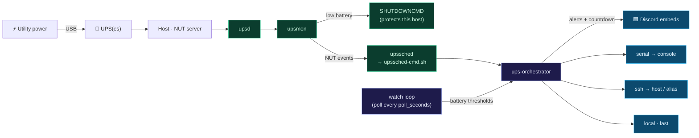
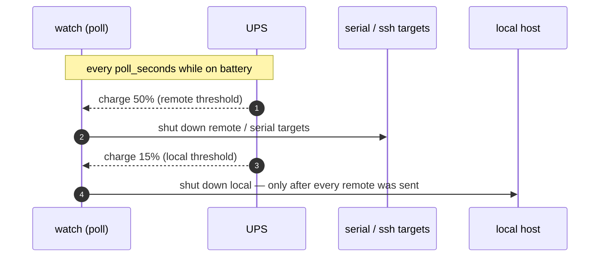

# ups-orchestrator ⚡

**NUT-driven UPS power-event monitor with per-UPS Discord embeds**

<p align="center">
  <em>Multi-UPS · NUT-event alerts · battery-threshold shutdown (serial / ssh / local) · zero runtime deps</em>
</p>

<p align="center">
  <a href="https://github.com/kleinpanic/ups-orchestrator/actions/workflows/ci.yml"></a>
  
  
  
  
  
</p>

It turns [Network UPS Tools](https://networkupstools.org/) power events into
**per-UPS Discord embeds** for on-battery alerts, a runtime-remaining countdown,
power-restored summaries, and low-battery warnings. NUT's own `upsmon` still
handles the host's protective shutdown, and the orchestrator can also shut down
UPS-powered machines over **serial**, **SSH**, or **locally** when a battery runs
low.

Works with any NUT-supported UPS and monitors **any number** of them. Nothing is
hard-coded to a model.

📖 **Full docs: the [project wiki](https://github.com/kleinpanic/ups-orchestrator/wiki).**

## Design

**Hybrid, primarily NUT event-driven:**

- **NUT `upssched` → orchestrator → Discord.** `upsmon` fires
  `ONBATT`/`ONLINE`/`LOWBATT`/`COMMBAD`/`COMMOK`, `upssched` passes them through
  `deploy/upssched-cmd.sh` to `ups-orchestrator <event> $UPSNAME`, which posts a
  labeled embed for that UPS.
- **Unified shutdown targets, local last.** Each UPS lists any number of
  `shutdown_targets`. A target fires when its battery `battery_below` (%) **or**
  `runtime_below` (sec) threshold is crossed:
  - `remote`: over SSH (`host` may be an `ssh_config` alias; omit `user`).
  - `serial`: over a serial console (`device`+`baud`) to a passwordless/
    auto-login getty. **Network-independent**, so it still works during an outage
    when SSH can't reach the box. That makes it the right primary path for power
    loss.
  - `local`: this host; always runs *after* every enabled remote/serial target on
    the UPS, so the watcher host dies last.

  NUT's `upsmon SHUTDOWNCMD` stays as a low-battery backstop. All targets off by default.
- **Configurable poll loop, decoupled from webhooks.** A `systemd --user` service
  (`ups-orchestrator watch`) polls every `poll_seconds` to evaluate shutdown
  thresholds; the on-battery countdown posts on its own `countdown_every_seconds`
  cadence (0 = off). Discord *alerts* stay NUT-event-driven; polling never gates
  them.



Two paths run independently: Discord *alerts* come from **NUT events**
(`upssched`), while battery-threshold *shutdowns* come from the **poll loop**
(`watch`). Each shutdown target picks its own transport: serial console
(network-independent, best during an outage), SSH (a host or `ssh_config`
alias), or the local host. The shutdown order is fixed below:



## Notifications

Embeds are rendered to the Discord spec with zero third-party dependencies
(stdlib `urllib`): author line, severity colour, a unicode battery gauge
(`▰▰▰▰▰▰▰▱▱▱ 72%`), inline status fields, a host/UPS footer, and a native
timestamp. Delivery is non-fatal (a down webhook never blocks NUT) and honours
HTTP 429 `retry_after`.

| Event | Embed |
|-------|-------|
| `onbatt` | 🔋 **ON BATTERY** — status, battery gauge, runtime, load, input V |
| `tick` (on battery) | ⏳ **still on battery** — runtime countdown |
| `online` | ✅ **POWER RESTORED** — outage duration + state |
| `lowbatt` | ⚠️ **LOW BATTERY** — critical, shutdown announced |
| `commbad` / `commok` | 🔌 comms lost / restored |
| (target due) | 🛑 **shutdown sent to `<target>`** |

The notifier sits behind a `Notifier` protocol, so a future **Discord bot** can
replace the webhook by implementing `Notifier.send`; the event logic does not
need to change.

## Configuration

Copy the template and fill it in. The webhook is **never** committed; it comes
from an environment variable.

```bash
cp config.example.json config.json
export UPS_DISCORD_WEBHOOK="https://discord.com/api/webhooks/…"
```

`config.json` has no secrets. Keys under `upses` are your NUT device names:

```jsonc
{
  "discord_webhook_env": "UPS_DISCORD_WEBHOOK",  // env var holding the URL
  "discord_username": "UPS Orchestrator",
  "poll_seconds": 30,            // how often the watch loop checks battery thresholds
  "countdown_every_seconds": 60, // on-battery countdown post cadence (0 = off)
  "shutdown_scope": "remote",    // global default: "remote" or "all" (per-UPS overridable)
  "upses": {
    "ups1": {
      "label": "Rack UPS",
      "shutdown_scope": "all",   // this UPS also shuts down the local host (last)
      "shutdown_targets": [
        { "name": "bigserver", "kind": "serial", "enabled": false,
          "device": "/dev/ttyUSB0", "baud": 115200,
          "cmd": "sudo /sbin/shutdown -h now", "battery_below": 50 },
        { "name": "fileserver", "kind": "remote", "enabled": false,
          "host": "mt", "cmd": "sudo /sbin/shutdown -h now",
          "battery_below": 50 },
        { "name": "this-host", "kind": "local", "enabled": false,
          "cmd": "sudo /sbin/shutdown -h now", "battery_below": 15 }
      ]
    },
    "ups2": { "label": "Desk UPS", "shutdown_targets": [] }
  }
}
```

**`shutdown_scope`** (global default, overridable per UPS) controls whether the
host running the daemon is in scope:
- `"remote"` (default) — only `serial`/`remote` targets fire; the local host is
  **never** shut down by the orchestrator (NUT's `upsmon` LOWBATT backstop still
  protects it). Any `local` targets are skipped.
- `"all"` — `local` targets fire too, **last** (at their own threshold), so the
  watcher stays up and notifying as long as possible, then dies last.

Per target:
- **`kind`**: `serial` (`device`+`baud`, to a passwordless/auto-login getty;
  network-independent), `remote` (`host` is a hostname *or* `ssh_config` alias;
  omit `user` for `ssh <alias>`), or `local`.
- **Trigger**: fires when **either** `battery_below` (charge %) or
  `runtime_below` (seconds) is crossed; omit both and it only fires on an
  explicit `remote_shutdown`.
- **Ordering**: `local` targets always run *after* every enabled serial/remote
  target on the UPS, so the watcher host dies last.
- `local` targets need passwordless shutdown (set up by `deploy/install.sh`);
  `serial`/`remote` need a passwordless console/SSH on the far end.

Config path resolves to `$UPS_ORCH_CONFIG`, else `/etc/ups-orchestrator/config.json`,
else `<repo>/config.json`. State resolves similarly via `$UPS_ORCH_STATE` /
`/var/lib/ups-orchestrator/state.json`.

## Status

```bash
ups-orchestrator status            # one-shot per-UPS table (alive/dead, gauge, runtime, load)
ups-orchestrator status --watch    # live-refreshing dashboard (Ctrl-C to exit)
```

## Install / Deploy

NUT's `nut` user can't read a `0700` home, so the orchestrator installs to a
**system venv** (`/opt/ups-orchestrator/venv` → `/usr/local/bin/ups-orchestrator`);
config/secret/state live under `/etc` + `/var/lib`; the `--user` watch service
reaches them via ACLs.

```bash
# 1) system install (root): venv, /etc config+env, /var/lib state, dispatcher, ACLs
sudo deploy/install.sh
sudo "$EDITOR" /etc/ups-orchestrator.env          # put your real webhook here

# 2) apply the NUT snippets (review first — set your UPS names + USB ids), then:
sudo systemctl restart nut-driver-enumerator nut-server nut-monitor
upsc -l                                            # expect your UPSes listed

# 3) poll-loop service (NO sudo)
loginctl enable-linger "$USER"
deploy/install-user-service.sh
```

| Path | What |
|------|------|
| `/usr/local/bin/ups-orchestrator` | the orchestrator (→ `/opt/ups-orchestrator/venv`) |
| `/usr/local/bin/upssched-cmd.sh` | NUT dispatcher (sources env, calls the orchestrator) |
| `/etc/ups-orchestrator/config.json` | per-UPS config (no secret) |
| `/etc/ups-orchestrator.env` | webhook + paths (`root:nut 0640` + user ACL) |
| `/var/lib/ups-orchestrator/state.json` | per-UPS state |
| `~/.config/systemd/user/ups-orchestrator-watch.service` | the `--user` poll loop |
| `/etc/sudoers.d/ups-orchestrator` | passwordless shutdown for `local` targets |

> Live config under `/etc` and `/etc/nut` holds your real device ids / IPs and
> stays on the machine; it is not part of this repo (and `config.json` is
> gitignored).

## Develop

```bash
python3 -m venv .venv && .venv/bin/pip install -e ".[dev]"
.venv/bin/ruff check . && .venv/bin/mypy && .venv/bin/pytest
```

CI runs ruff + mypy(strict) + pytest on every push/PR across Python 3.11–3.13
(read-only; it never writes to the repo). Tagging `vX.Y.Z` triggers a release
(builds the wheel + sdist, generates notes, publishes a GitHub Release).

## Docs & contributing

- 📖 [Wiki](https://github.com/kleinpanic/ups-orchestrator/wiki): full guides (synced from [`docs/`](docs/))
- 📝 [CHANGELOG](CHANGELOG.md) · [CONTRIBUTING](CONTRIBUTING.md) · [SECURITY](SECURITY.md)

## License

MIT. See [LICENSE](LICENSE).
