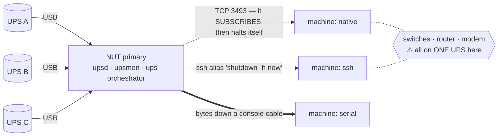
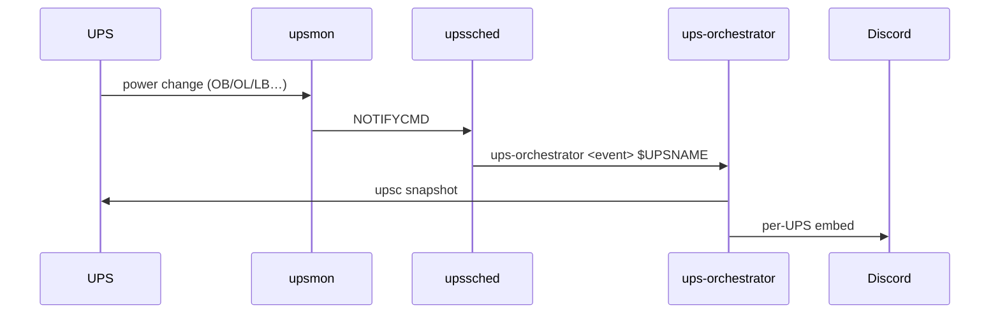
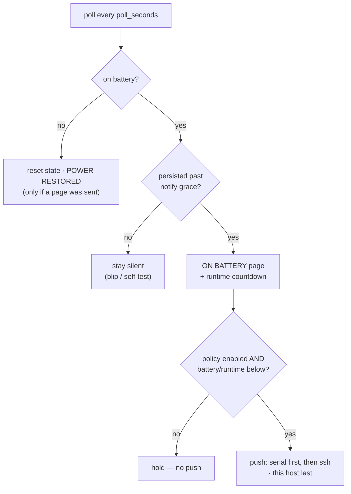

# Architecture

## The topology this is all built around

Every UPS data cable plugs into **one machine** — the NUT primary. It is the
only host on the network that can read a battery percentage or a runtime
estimate; no other machine can see a UPS at all. Everything below follows from
that.

The dotted links need the network; the thick one does not. That is the whole
decision. Which method to pick, and why, is on the
[home page](index.md) and in [Shutdown mechanisms](Shutdown-Mechanisms.md).

Note where the arrows point. A **`native`** machine is reached by nothing — it
reaches *in*, to `upsd`, and powers itself off. **`ssh`** and **`serial`** are
pushes the primary performs. A machine holds exactly one of the three, and a
`native` machine is deliberately never projected onto a push target: its own
`upsmon` is already going to halt it, so pushing as well would shut it down
twice.

## Two independent paths

Within the primary there are two paths through the code, and they don't depend
on each other.

## The event path — alerts

NUT detects power changes. `upsmon` runs `upssched` as its `NOTIFYCMD`, and the
AT-rules in `upssched.conf` hand each event (`ONBATT`, `ONLINE`, `LOWBATT`,
`COMMBAD`, `COMMOK`) to `upssched-cmd.sh`, which calls
`ups-orchestrator <event> $UPSNAME`. The matching handler reads a snapshot of
that UPS and posts a Discord embed.

Every alert is tied to a real NUT event. Nothing here is on a timer.

## The poll path — pushed shutdowns

`ups-orchestrator watch` is a long-running service that wakes every
`poll_seconds`, reads each UPS, and decides whether any **push** should fire.
While on battery it also posts the runtime countdown on its own cadence
(`countdown_every_seconds`). That's the only thing the poll loop sends to
Discord.

Serial fires before ssh — serial doesn't need the network the outage may be
taking down — and this host's own poweroff only goes once every push on that
UPS has been attempted, so the watcher dies last. The sort is stable, so
declared order still holds within each transport.

!!! warning "This path is the only thing that fires a push"
    If the `watch` unit is not running, **no `serial` or `ssh` machine is ever
    shut down**. NUT still delivers its own notifications and a `native`
    secondary still halts itself, so the outage looks handled while every pushed
    machine rides the battery to the floor.
    `systemctl --user status ups-orchestrator-watch` is a shutdown-path check,
    not just a monitoring one.

    A `native` machine is not on this path at all. Nothing in this repo fires
    it, gates it, or can stop it — see
    [Shutdown mechanisms](Shutdown-Mechanisms.md).

## Code layout

| Module | Job |
|--------|-----|
| `cli.py` | argument routing for every subcommand |
| `events.py` | event handlers, poll logic, notify grace, shutdown executors |
| `nut.py` | thin wrappers over the `upsc` / `upscmd` CLIs |
| `notify.py` | the `Notifier` protocol and the Discord webhook renderer |
| `config.py` | typed config loading |
| `state.py` | per-UPS state, written atomically |
| `status.py` | the bordered terminal panels (`status` / `--watch`) |
| `recorder.py` | high-frequency telemetry samples for baseline/dashboard |
| `baseline.py` / `selftest.py` | draw stats · injectable battery self-test |
| `webui.py` / `dashboard.py` | stdlib web dashboard · matplotlib power image |
| `audit.py` / `jsonlog.py` | incident report · atomic JSONL event/notify logs |

Side effects (UPS reads, shutdowns, the clock, the network) are injected through
`events.Deps`, so the handlers are tested without real hardware. The notifier
sits behind a protocol, so swapping the webhook for a Discord bot later is a
small change.
