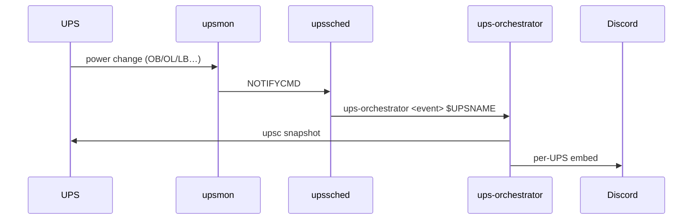
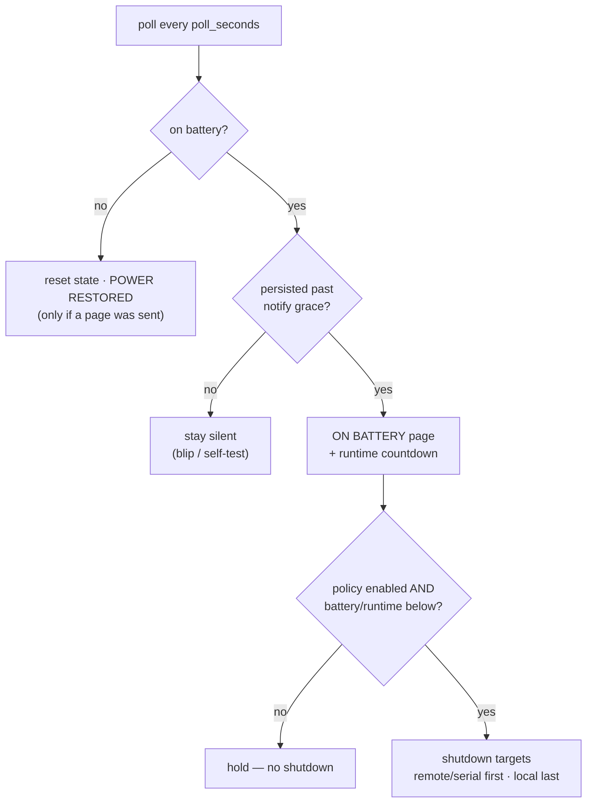

# Architecture

There are two paths through the system, and they don't depend on each other.

## The event path — alerts

NUT detects power changes. `upsmon` runs `upssched` as its `NOTIFYCMD`, and the
AT-rules in `upssched.conf` hand each event (`ONBATT`, `ONLINE`, `LOWBATT`,
`COMMBAD`, `COMMOK`) to `upssched-cmd.sh`, which calls
`ups-orchestrator <event> $UPSNAME`. The matching handler reads a snapshot of
that UPS and posts a Discord embed.

Every alert is tied to a real NUT event. Nothing here is on a timer.

## The poll path — shutdowns

`ups-orchestrator watch` is a long-running service that wakes every
`poll_seconds`, reads each UPS, and decides whether any shutdown target should
fire. While on battery it also posts the runtime countdown on its own cadence
(`countdown_every_seconds`). That's the only thing the poll loop sends to
Discord.

Targets fire remotes and serials first; a `local` target only goes once every
enabled remote/serial target on that UPS has already been triggered.

## Code layout

| Module | Job |
|--------|-----|
| `cli.py` | argument routing for every subcommand |
| `events.py` | event handlers, poll logic, notify grace, shutdown executors |
| `nut.py` | thin wrappers over the `upsc` / `upscmd` CLIs |
| `notify.py` | the `Notifier` protocol and the Discord webhook renderer |
| `config.py` | typed config loading |
| `state.py` | per-UPS state, written atomically |
| `status.py` | the bordered terminal panels (`status` / `--watch`) |
| `recorder.py` | high-frequency telemetry samples for baseline/dashboard |
| `baseline.py` / `selftest.py` | draw stats · injectable battery self-test |
| `webui.py` / `dashboard.py` | stdlib web dashboard · matplotlib power image |
| `audit.py` / `jsonlog.py` | incident report · atomic JSONL event/notify logs |

Side effects (UPS reads, shutdowns, the clock, the network) are injected through
`events.Deps`, so the handlers are tested without real hardware. The notifier
sits behind a protocol, so swapping the webhook for a Discord bot later is a
small change.
