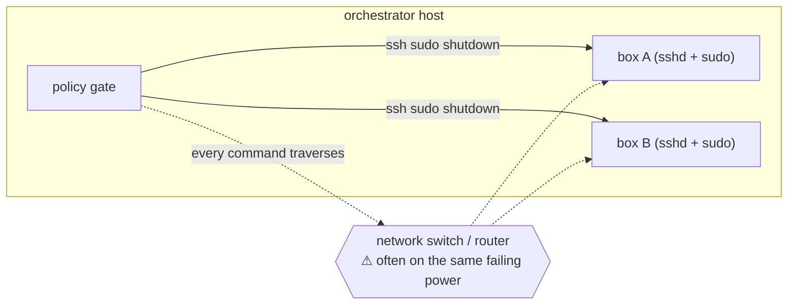
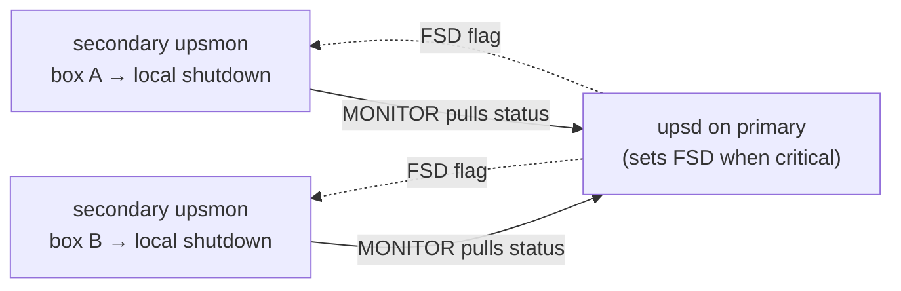

# Shutdown mechanisms: SSH push vs. native NUT

The orchestrator can power down UPS-fed machines three ways — `serial`, `remote`
(SSH), and `local` (see [Shutdown targets](Shutdown-Targets.md)). The SSH path is
the convenient one, and it is also the one with the most failure modes. This page
describes that pathology honestly and asks whether NUT's own distributed-shutdown
model is a better fit.

## What the SSH path actually does

`_default_ssh_shutdown` runs, per target:

```text
ssh -o BatchMode=yes -o ConnectTimeout=10 <user@host> "sudo /sbin/shutdown -h now"
```

The orchestrator **pushes** a shutdown command *into* each box over SSH when its
per-group policy (`battery_below` / `runtime_below`) trips.



## The pathology

1. **Network dependency in the exact failure window.** A grid outage is *when* you
   need the shutdown, and it is also when the switch/router/AP between the
   orchestrator and the target is most likely dark (unprotected, or on another
   draining UPS). SSH then times out (`ConnectTimeout=10`) and the box never shuts
   down gracefully — it hard-drops when its UPS empties. Serial exists precisely
   because it sidesteps this; SSH does not.
2. **It reimplements NUT's distributed shutdown — with more moving parts.** NUT
   already solves "shut down every machine on a dying UPS" with the primary/secondary
   model (below). The SSH path rebuilds a slice of that as an outbound command
   channel that needs `sshd`, a login, a shell, and a passwordless `sudo shutdown`
   on every target.
3. **Credential/trust inversion.** SSH shutdown means the orchestrator holds keys
   that can run `sudo shutdown` on *every* box — a lateral-movement liability that
   points the wrong way (one host able to halt the fleet). NUT's model inverts this:
   each box pulls state from the primary and shuts *itself* down.
4. **No coordination with NUT's own state.** The SSH decision runs on the
   orchestrator's thresholds, independent of NUT's `LOWBATT`/FSD. Two shutdown
   authorities on one UPS with no shared sequencing; the "local dies last" ordering
   is a hand-rolled fragment of what NUT sequences natively.
5. **Fire-and-forget correctness gaps.** A box mid-shutdown may drop the SSH
   connection, so a *successful* shutdown can return non-zero and page a false
   failure.

## The native NUT model (primary / secondary + FSD)

In NUT, one host is the **primary** (runs `upsd`, owns the UPS). Every other
UPS-fed host runs `upsmon` as a **secondary**, monitoring that `upsd` over TCP.
When the UPS is critical the primary raises the **FSD** (forced-shutdown) flag;
each secondary sees it and runs its *own* `SHUTDOWNCMD` locally. No SSH, no keys
pushed around, no reverse command channel.



This is the credential-minimal, coordinated, pull-based design NUT is built for.
It removes pathologies 2–5 outright.

## The honest trade-off

| | SSH push (current) | Native NUT (secondary + FSD) | Serial |
|---|---|---|---|
| Survives a dead network | ❌ | ❌ (upsd is over TCP) | ✅ |
| Credential surface | keys + sudo on every box | read MONITOR creds only | none (getty) |
| Coordinated with NUT | no | yes (native) | no |
| Per-**box** threshold on one UPS | ✅ | ❌ (FSD is per-UPS) | ✅ |
| Works on non-NUT appliances | ✅ | ❌ (needs nut-client) | ✅ (any console) |
| Agent required on target | sshd + sudo | nut-client | auto-login getty |

Native NUT does **not** fix the network pathology — `upsd` is reached over TCP, so
a secondary is as blind as SSH when the switch is dark. Only **serial** is
network-independent. What native NUT fixes is the *credential inversion*, the
*coordination gap*, and the *reimplementation* — for boxes that can run nut-client.

## Recommended shape

Keep the orchestrator as the **policy brain**, but prefer *wrapping* NUT over
pushing SSH:

- **Network-reachable, nut-capable boxes** → run them as **NUT secondaries** and let
  the orchestrator *trigger* the native path (raise FSD on the UPS via
  `upsmon -c fsd` / an `upssched` action) instead of SSHing each one. Per-UPS
  granularity, credential-minimal, coordinated.
- **Serial** → keep as the **network-independent backstop** for the boxes that
  matter most. This is the only path that survives the outage-network case, so it
  is not replaceable by either SSH or native NUT.
- **SSH** → reserve for boxes that *cannot* run nut-client (appliances, locked-down
  NAS) and are reachable by a network that stays up (e.g. PoE gear on its own UPS).
  Treat it as the fallback, not the default.

The per-box thresholds the current policy layer offers are the one thing plain FSD
can't express; if that granularity is actually needed, it belongs at the primary's
decision logic (the orchestrator) driving FSD, not in an SSH fan-out.
