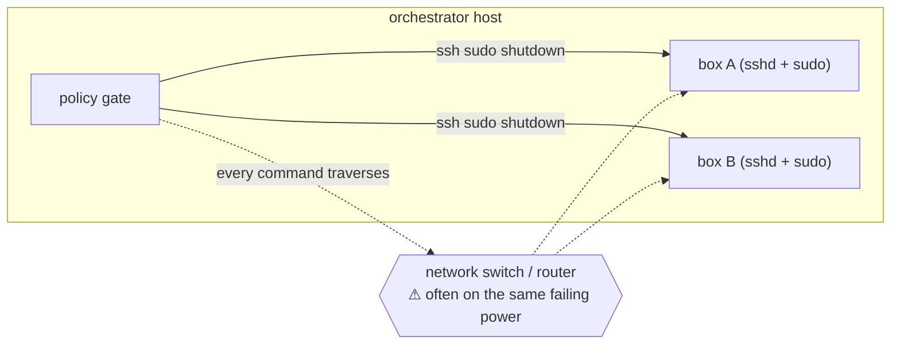
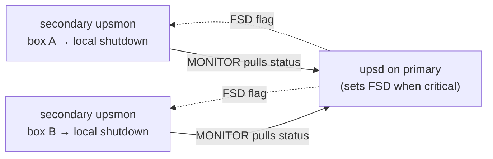

# Shutdown mechanisms: SSH push vs. native NUT

Every enrolled machine (`monitored_machines[]`, see
[Configuration](Configuration.md)) carries exactly one **effective
`shutdown_method`**: `none`, `native`, `serial`, or `ssh`. `native` wraps NUT's
own primary/secondary model (below); `serial` and `ssh` are the orchestrator's
own **push** transports — it reaches out to the machine over a console cable or
an SSH connection and sends the shutdown command itself. (The legacy
per-UPS `shutdown_targets[]` array, described in
[Shutdown Targets](Shutdown-Targets.md), predates the per-machine model and is
kept only for back-compat; its `remote`/`serial`/`local` kinds map onto
`shutdown_method` `ssh`/`serial`/(the local host, which has no
`monitored_machines` entry at all).) The SSH push path is the convenient one,
and it is also the one with the most failure modes. This page describes that
pathology honestly and asks whether NUT's own distributed-shutdown model is a
better fit.

## Ordering: serial before ssh, and per-machine push vs. per-UPS native

When more than one push-managed machine is due on the same UPS, **serial fires
before ssh**: serial is network-independent (a console cable, not a route
through the switch), while ssh dies with the network the same outage may be
killing. The sort is stable, so declared order still holds within each
transport.

This is also the point where `native` and a push method are structurally
different kinds of authority, not two options on a spectrum: `native` is a
**per-UPS** mechanism — the remote secondary's own `upsmon` reacts to the
*primary's* NUT-level FSD flag for that UPS, with no orchestrator involvement
at fire time at all — while `serial`/`ssh` are **per-machine** decisions the
orchestrator itself makes and executes, one machine at a time, on each poll.
A `native` machine is therefore **never** projected onto a push attempt (doing
so would shut it down twice); only `serial`/`ssh` machines are.

**"UPS is close to empty" means two different things for the two authorities.**
For a `serial`/`ssh` push, "close to empty" is the orchestrator's own
configured `shutdown.external` group thresholds (`battery_below` /
`runtime_below`) evaluated against the current snapshot — an operator-tunable
gate. For `native`, the trigger is NUT's own low-battery (`LB`) condition on
the primary, which is an entirely separate mechanism with its own thresholds
configured in NUT itself, not in this orchestrator's config at all.

### The push is NOT driven by NUT's `LB` flag — read this before relying on it

The paragraph above is easy to read as "both authorities fire at low battery,
just with different thresholds". They do not share a *mechanism*, and the
difference decides whether a push happens at all:

- **`native` fires from NUT.** The primary raises FSD on its own `LB` condition
  and the remote secondary's `upsmon` halts the box. Nothing in this repo is
  involved, and nothing in this repo can stop it.
- **A `serial`/`ssh` push fires from this orchestrator's `watch` poll loop, and
  from nowhere else.** `UpsSnapshot.low_battery` — the parsed `LB` flag — has
  **zero consumers in the shutdown gate**. It is read only by `status`,
  `report`, `selftest` and the web UI, all of which merely display it.
  `deploy/nut/upssched.conf.snippet` does map `AT LOWBATT * EXECUTE lowbatt`
  and `deploy/upssched-cmd.sh` does forward it, but `handle_lowbatt` writes a
  `lowbatt` event and sends one notification, then returns. **It never reaches
  the shutdown path.**

Three consequences follow, and none is obvious from the requirement text:

1. **If the `watch` unit is not running, no push ever fires.** NUT will still
   deliver its LOWBATT notification and a `native` secondary will still halt
   itself, so the outage looks handled — while every `serial`/`ssh` machine
   silently rides the battery to the floor. `systemctl --user status
   ups-orchestrator-watch` is therefore a shutdown-path check, not just a
   monitoring one.
2. **Both `shutdown.external` thresholds must be crossed, not either.** When
   `battery_below` *and* `runtime_below` are both set, `_close_to_empty` ANDs
   them. A UPS at 5% charge that still reports 20 minutes of runtime does not
   open the gate. Only when one of the two is left unset does the other decide
   alone.
3. **A UPS that raises `LB` without reporting charge *or* runtime never opens
   the gate at all.** With both readings unknown, `_close_to_empty` returns
   `False` — deliberately, and pinned by
   `test_an_undefined_close_to_empty_condition_never_fires`. This is the shape a
   dying UPS actually produces (`upsc` stops reporting `battery.charge` and
   `battery.runtime` while `ups.status` still says `OB`), and firing on it would
   power off every box on that UPS on a bad read. The cost is the mirror image:
   such a UPS is one where `native` still halts its secondaries on FSD while no
   push ever fires, no matter how the thresholds are set. If you have a unit that
   reports `LB` and nothing else, `native` is the only authority that works on
   it.

This split is deliberate — `native` at NUT's LB, push at operator-tunable
thresholds crossed earlier — but it means the two authorities can fire minutes
apart, and it means the push has a liveness dependency that `native` does not.

**Local-last, and what that costs during an outage (D-7).** The watcher host's
own `local` target — its own poweroff — is always held until every enabled
remote/serial/push target on the same UPS has been *attempted* (not
necessarily succeeded — see below). So each enrolled push machine on that UPS
adds its own transport timeout to the delay before the watcher host powers
itself off: the serial path's `stty` call plus a settle delay, or the ssh
path's connect timeout, each running in turn. A push that **fails** does not
block the local target — only a push that has not yet been *attempted* does —
so a hung or unreachable machine slows the watcher's own shutdown by its
timeout, but can never prevent it.

## What the SSH path actually does

`_default_ssh_shutdown` runs, per target:

```text
ssh -o BatchMode=yes -o ConnectTimeout=10 <user@host> "sudo /sbin/shutdown -h now"
```

The orchestrator **pushes** a shutdown command *into* each box over SSH when its
per-group policy (`battery_below` / `runtime_below`) trips.



## The pathology

1. **Network dependency in the exact failure window.** A grid outage is *when* you
   need the shutdown, and it is also when the switch/router/AP between the
   orchestrator and the target is most likely dark (unprotected, or on another
   draining UPS). SSH then times out (`ConnectTimeout=10`) and the box never shuts
   down gracefully — it hard-drops when its UPS empties. Serial exists precisely
   because it sidesteps this; SSH does not.
2. **It reimplements NUT's distributed shutdown — with more moving parts.** NUT
   already solves "shut down every machine on a dying UPS" with the primary/secondary
   model (below). The SSH path rebuilds a slice of that as an outbound command
   channel that needs `sshd`, a login, a shell, and a passwordless `sudo shutdown`
   on every target.
3. **Credential/trust inversion.** SSH shutdown means the orchestrator holds keys
   that can run `sudo shutdown` on *every* box — a lateral-movement liability that
   points the wrong way (one host able to halt the fleet). NUT's model inverts this:
   each box pulls state from the primary and shuts *itself* down.
4. **No coordination with NUT's own state.** The SSH decision runs on the
   orchestrator's thresholds, independent of NUT's `LOWBATT`/FSD. Two shutdown
   authorities on one UPS with no shared sequencing; the "local dies last" ordering
   is a hand-rolled fragment of what NUT sequences natively.
5. **Fire-and-forget correctness gaps.** A box mid-shutdown may drop the SSH
   connection, so a *successful* shutdown can return non-zero and page a false
   failure.

## The native NUT model (primary / secondary + FSD)

In NUT, one host is the **primary** (runs `upsd`, owns the UPS). Every other
UPS-fed host runs `upsmon` as a **secondary**, monitoring that `upsd` over TCP.
No SSH, no keys pushed around, no reverse command channel — the secondary shuts
*itself* down. There are **two** ways it decides to, and which one applies depends
on the primary's `powervalue` for that UPS:

- **Primary-driven FSD** — if the primary declares `powervalue ≥ 1` for the UPS
  (i.e. it is itself fed by it), then when the primary hits low-battery it raises
  the **FSD** (forced-shutdown) flag; every secondary polls it off `upsd`
  (`ups.status` → `OB LB FSD`) within one `POLLFREQALERT` and runs `SHUTDOWNCMD`.
- **Secondary self-trigger** — if the primary is `powervalue 0` for that UPS
  (monitors it but isn't powered by it — *this is exactly eulerpi5's case for the
  Rack and Third UPSes*), the primary never raises FSD for it. The secondary must
  therefore reach the decision itself: with `powervalue 1` + `MINSUPPLIES 1` it
  shuts down the moment it reads its own UPS as `OB LB` (or after `DEADTIME` if the
  UPS was last seen `OB` and then goes silent).

Either way the secondary runs plain `shutdown -h now` — a secondary must **never**
run `killpower`/`POWERDOWNFLAG` (it has no UPS to power off; doing so is a known
foot-gun).



This is the credential-minimal, coordinated, pull-based design NUT is built for.
It removes pathologies 2–5 outright — but it introduces **one new gap of its own**:

!!! warning "The primary-dies-first hole"
    Secondaries monitor `upsd` **on the primary**. If the primary's *own* UPS dies
    first, the primary powers off, `upsd` vanishes, and the secondaries lose their
    monitor for *their* UPS. During a real outage (everything already `OB`) each
    secondary's local `DEADTIME`-on-`OB` timer still fires, so they shut down safely.
    But if the primary (or the network switch) dies on an otherwise **healthy grid**,
    the secondaries are left up-but-blind until the feed returns. `upsmon` treats
    prolonged comm-loss as a *warning*, not a shutdown — by design. The durable fix
    is a **second, independent `upsd`** the secondaries also monitor (Option B,
    deferred). A `serial`/`ssh` push machine on the same box does **not** cover
    this hole either: it still runs on the primary, so it dies with the primary
    and can't cross a dark switch — and in any case a machine cannot be both
    `native` and a push authority at once (see
    [Configuration → mutual exclusion](Configuration.md)). See
    [Deployment → Known limitation: primary-dies-first](Deployment.md) for the
    full covered/uncovered breakdown and the shipped Option A mitigation.

## The honest trade-off

| | SSH push (current) | Native NUT (secondary + FSD) | Serial |
|---|---|---|---|
| Survives a dead network | ❌ | ❌ (upsd is over TCP) | ✅ |
| Credential surface | keys + sudo on every box | read MONITOR creds only | none (getty) |
| Coordinated with NUT | no | yes (native) | no |
| Per-**box** threshold on one UPS | ✅ | ❌ (FSD is per-UPS) | ✅ |
| Works on non-NUT appliances | ✅ | ❌ (needs nut-client) | ✅ (any console) |
| Agent required on target | sshd + sudo | nut-client | auto-login getty |

Native NUT does **not** fix the network pathology — `upsd` is reached over TCP, so
a secondary is as blind as SSH when the switch is dark. Only **serial** is
network-independent. What native NUT fixes is the *credential inversion*, the
*coordination gap*, and the *reimplementation* — for boxes that can run nut-client.

## Recommended shape

Keep the orchestrator as the **policy brain**, but prefer *wrapping* NUT over
pushing SSH:

- **Network-reachable, nut-capable boxes** → enroll them as **NUT secondaries**
  with `ups-orchestrator monitor add` (see
  [Deployment → Enroll NUT secondaries](Deployment.md)). The CLI writes each
  secondary with `powervalue 1` + `MINSUPPLIES 1` + `DEADTIME 30` so it
  self-triggers on its own `OB LB` (the primary here is `powervalue 0` for those
  UPSes and won't raise FSD for them). Credential-minimal, coordinated, no SSH
  fan-out.
- **Serial** → keep as the **network-independent** `shutdown_method` for the
  boxes that matter most, enrolled with `monitor add --method serial`. This is
  the only path that survives the outage-network case, so it is not
  replaceable by either `ssh` or `native`.
- **`serial` / `ssh` as a machine's shutdown_method** → default-off (the
  central `shutdown.enabled` gate), and **mutually exclusive with `native`**
  on the same machine — a machine takes exactly one shutdown authority, never
  both. A native-plus-deadman regime (a push firing only as a last resort
  strictly below a native secondary's own LB point) was considered for this
  phase and **dropped**; it is deferred to a possible future phase. Neither
  `serial` nor `ssh` covers the primary-dies-first hole (it dies with the
  primary) — that's what the future redundant `upsd` is for.

The per-box thresholds the current policy layer offers are the one thing plain FSD
can't express; if that granularity is actually needed, it belongs at the primary's
decision logic (the orchestrator) driving FSD, not in an SSH fan-out.
