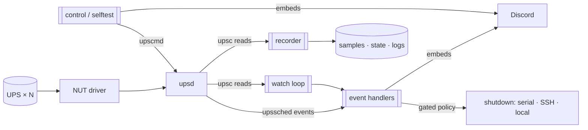

# ups-orchestrator

A small, dependency-free daemon that watches your UPSes through
[NUT](https://networkupstools.org/) and turns power events into per-UPS Discord
embeds. With an explicit opt-in policy it can also shut down the machines a UPS
powers — over a serial console, SSH, or locally — while leaving the host's own
protective shutdown to NUT's `upsmon`. It runs well on a Raspberry Pi and has no
runtime dependencies beyond the standard library and NUT's `upsc`/`upscmd` CLIs.

## Architecture at a glance

## Where to go next

- **[Configuration](Configuration.md)** — the `config.json` reference (poll cadence,
  on-battery notify grace, per-UPS load-step overrides, shutdown policy).
- **[Shutdown targets](Shutdown-Targets.md)** — serial vs SSH vs local, policy gates, ordering.
- **[Deployment](Deployment.md)** — system install, NUT wiring, the watch service, the
  least-privilege control user.
- **[Architecture](Architecture.md)** — the event path and the poll path in detail.

## Commands

| Command | What it does |
|---|---|
| `status` / `status --watch` | bordered per-UPS TUI panels (battery/load gauges, draw sparkline) |
| `report` | daily Discord load report (weekly power dashboard image) |
| `baseline` | per-UPS draw stats (median/p95/mean) from recorder history |
| `selftest` | run a NUT battery self-test per UPS, alert on failure |
| `control <action>` | safe instant commands (beeper, battery test) across UPSes, with a Discord counterpart |
| `webui` | local stdlib web dashboard (localhost only) |
| `audit` | boot / UPS / log / shutdown evidence summary |

`control` and `selftest` need admin creds in the environment
(`UPS_NUT_ADMIN_USER` / `UPS_NUT_ADMIN_PASSWORD`), never the config. These consumer
CyberPower units expose **no** software display/LCD control.
